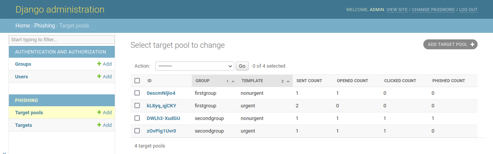
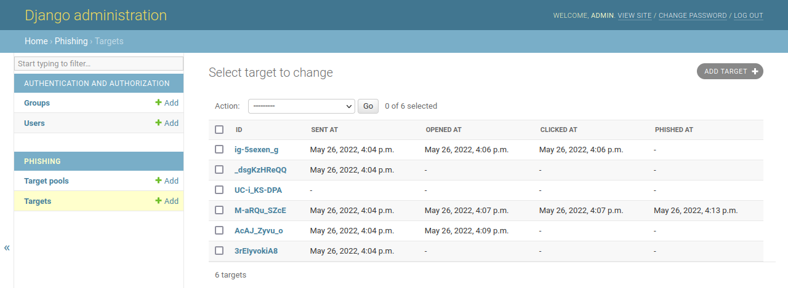

# Phishstick

Phishstick is a privacy-by-design Django phishing framework. It was created to conduct an awareness campaign at the University of Namur, Belgium. In particular, it offers anonymity in the results, a feature that is not currently available in [Gophish](https://github.com/gophish/gophish) (see [this issue](https://github.com/gophish/gophish/issues/1139)).

The way it works is by generating a completely random identifier for each recipient when sending emails. Another random identifier is generated for each group (or department) assigned to the recipients. Both identifiers are included in the emails and are stored in the database. Once the messages have been sent, the mailing list can therefore be discarded while still making the results available anonymously by group.





## **Disclaimer of liability**

**Phishstick is only made public for educational purposes. As its [licence](#license) indicates, "in no event shall the authors or copyright holders be liable for any claim, damages or other liability, whether in an action of contract, tort or otherwise, arising from, out of or in connection with the software or the use or other dealings in the software."**

**If you want to launch a real phishing attack, there probably exists much better software than this anyway. So go away.**

**If, however, you want to run an awareness campaign in your organization, you can stay. But make sure you have all the required authorizations. I cannot be held responsible for your mistakes.**

## Getting started

Setup everything in a virtual environment:

```console
$ python3 -m venv venv
$ source venv/bin/activate
$ pip install -r requirements.txt
$ python manage.py migrate
$ python manage.py createsuperuser
```

Run the server in debug mode:

```console
$ python manage.py runserver
```

Send emails:

```console
$ python manage.py send_emails addresses.csv
```

For more information, see the [next section](#usage). To deploy this application in a production environment, please first refer to [Django's documentation](https://docs.djangoproject.com/en/4.0/howto/deployment/checklist/).

The following environment variables are available:

| Name                  | Description                                                                                                                                                                    | Default value            |
| --------------------- | ------------------------------------------------------------------------------------------------------------------------------------------------------------------------------ | ------------------------ |
| `DEBUG`               | Enable [Django's debug mode](https://docs.djangoproject.com/en/4.0/ref/settings/#debug). In addition, if enabled, emails will be printed in the console instead of being sent. | `True`                   |
| `SECRET_KEY`          | [Django's secret key](https://docs.djangoproject.com/en/4.0/ref/settings/#secret-key). It must be set in production.                                                           | An insecure key          |
| `ALLOWED_HOSTS`       | [Django's allowed hosts](https://docs.djangoproject.com/en/4.0/ref/settings/#allowed-hosts) separated by commas. It must be set to the server's FQDN in production.            | `None`                   |
| `EMAIL_PORT`          | Server port to which emails will be sent.                                                                                                                                      | `465`                    |
| `EMAIL_USE_SSL`       | Whether implicit TLS should be used to send emails.                                                                                                                            | `True`                   |
| `EMAIL_HOST`          | SMTP server's hostname.                                                                                                                                                        | `'localhost'`            |
| `EMAIL_HOST_USER`     | Username used for SMTP authentication.                                                                                                                                         | `''`                     |
| `EMAIL_HOST_PASSWORD` | Password used for SMTP authentication.                                                                                                                                         | `''`                     |
| `DATABASE_URL`        | URL describing the database configuration. Look [here](https://github.com/jazzband/dj-database-url#url-schema) for examples.                                                   | `'sqlite:///db.sqlite3'` |

## Usage

Please note that a minimal knowledge of how Django works may be useful for configuring Phishstick. For a quick start, you can refer to [its documentation](https://docs.djangoproject.com/en/4.0/).

In this example, we have a server at "pirate.example.org" from which we want to send our emails. We will send them to "smtp.example.org", a mail server that we also own. On the latter, we have created an email address, "totallylegit@example.org", which will be our sender. Regarding the content of the emails, we will have two different templates: one will contain an urgent message, the other will not.

Here are the files you actually care about:

```
phishstick/
├── manage.py
├── phishstick/
│   └── settings.py
└── phishing/
    ├── urls.py
    ├── views.py
    └── templates/
        ├── base.html
        ├── 1.sent.urgent.html
        ├── 1.sent.urgent.txt
        ├── 1.sent.nonurgent.html
        ├── 1.sent.nonurgent.txt
        ├── 2.clicked.urgent.html
        ├── 2.clicked.nonurgent.html
        └── 3.phished.html
```

As you can see, the ["templates"](./phishing/templates/) folder already contains the content of the emails and pages we will be using. Please take a look at it. As you may have noticed, for each email template there are two files: one ".txt" and one ".html". This is because the SMTP protocol always requires a plain text version, even if you send an HTML message.

In ["settings.py"](./phishstick/settings.py), we will configure the email templates:

```python
PHISHING_TEMPLATES = {
    'urgent': {
        'SUBJECT': '[URGENT] Do something!',
        'FROM': 'totallylegit@example.org',
        'TEXT_TEMPLATE': '1.sent.urgent.txt',
        'HTML_TEMPLATE': '1.sent.urgent.html',
    },
    'nonurgent': {
        'SUBJECT': 'Hi',
        'FROM': 'IT Team <totallylegit@example.org>',
        'TEXT_TEMPLATE': '1.sent.nonurgent.txt',
        'HTML_TEMPLATE': '1.sent.nonurgent.html',
    },
}
```

We can define different settings for each template. The "FROM" parameter can be either a simple email address or a "`Name <address@domain>`" string. The latter is an effective way to phish, as most mail clients will hide the address.

In ["urls.py"](./phishing/urls.py) and ["views.py"](./phishing/views.py), we will configure the website templates:

```python
# urls.py
urlpatterns = [
    path('logo.png', views.opened, name='opened'),
    path('login', views.clicked, name='clicked'),
    path('submit', views.phished, name='phished'),
]

# views.py
@phish(Status.OPENED)
def opened(request: HttpRequest):
    """Respond with a transparent pixel."""

    return HttpResponse(PIXEL, content_type='image/png')


@phish(Status.CLICKED)
def clicked(request: HttpRequest):
    """Respond with the assigned template."""

    return render(request, f'2.clicked.{request.template}.html')


@phish(Status.PHISHED)
def phished(request: HttpRequest):
    """Respond with a common landing page."""

    return render(request, '3.phished.html')
```

This is an example configuration, but you can define the views as you wish, just as you would with Django. The "request" parameter contains the recipient IDs in the "target_id" and "pool_id" fields. It will also contain the template and group names in the "template" and "group" fields. This is because we use the "phish" decorator. Take a look at [its implementation](./phishing/decorators.py) for more information.

Finally, put each target address with its corresponding group into a CSV file. We will name it "addresses.csv":

```csv
alice.karen@outlook.com,firstgroup
jacques.bob@gmail.com,firstgroup
michel.kevin@gmail.com,firstgroup
manon.phoebe@gmail.com,secondgroup
marcel.mike@yahoo.fr,secondgroup
dominique.michelle@gmail.com,secondgroup
```

Start the phishing:

```console
$ python manage.py send_emails addresses.csv
Found 6 distinct email addresses.
Found 2 groups:
 * 'firstgroup' (3 addresses)
 * 'secondgroup' (3 addresses)
Is this correct? [y/n] y
Found 2 templates:
 * 'urgent'
 * 'nonurgent'
Is this correct? [y/n] y
Are you sure you want to send 6 emails? [y/n] y
Let the phishing begin!
[1/6] Sending email to 'alice.karen@outlook.com' (group='firstgroup', template='urgent').
[2/6] Sending email to 'michel.kevin@gmail.com' (group='firstgroup', template='urgent').
[3/6] Sending email to 'jacques.bob@gmail.com' (group='firstgroup', template='nonurgent').
[4/6] Sending email to 'dominique.michelle@gmail.com' (group='secondgroup', template='urgent').
Failed: Exception('bad luck')
[5/6] Sending email to 'manon.phoebe@gmail.com' (group='secondgroup', template='urgent').
[6/6] Sending email to 'marcel.mike@yahoo.fr' (group='secondgroup', template='nonurgent').
Done. However, 1 emails could not be sent.
Use 'python manage.py resend_emails failures.2022_05_23_21_51_15.csv' to try again.
```

If some emails failed, try to resend them:

```console
$ python manage.py resend_emails failures.2022_05_23_21_51_15.csv
Found 1 failures.
Are you sure you want to retry sending these emails? [y/n] y
[1/1] Sending email to 'dominique.michelle@gmail.com' (group='secondgroup', template='urgent').
Done. All emails sent.
```

That's it, you can now go to https://pirate.example.org/admin/ to see the results.

## License

The source code is under an [MIT license](./LICENSE).
